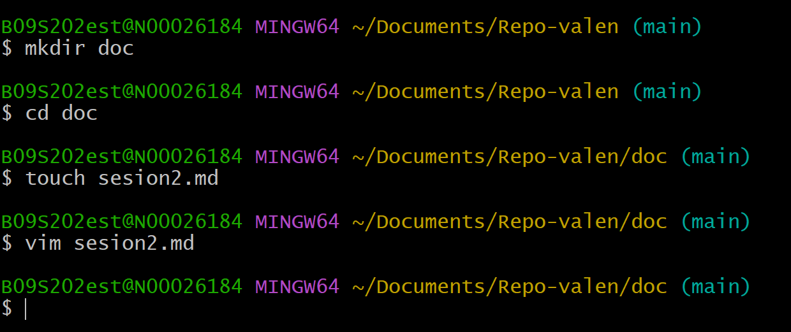

# Cómo crear un repositorio nuevo en GitHub

Primero, nos registramos con un correo, username, y una contraseña.

Segundo, al ingresar en la parte superior a la derecha de damos click a un símbolo que tiene un "+" y se despliega unas opciones, le damos click en "new repository".

Tercero, se abre una página nueva, llenamos los datos del repositorio con el nombre que aparece en la carpeta, y creamos el nuevo repositorio.

Cuarto, se refresac la página y aparecen unos enlaces; se copia el que es de la sección "or push an existing repository from command line".

Quinto, para verificar que funcionó se escribe *git remote -v*.

Sexto, al escribir ese código debe aparecer 2 veces el link, uno que al final diga (fetch) y otro que al final diga (push).

Séptimo, después de eso se escribe el código *git push -u origin main*.

Octavo, luego nse abre una ventana titilando roja y vuelve a pedir un registro. Al ingresar aparece en Git ya enlazado con el repositorio.

